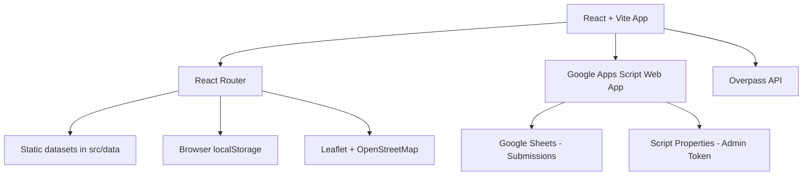

<div align="center">

# MeLokal
### Discover local experiences. Plan a journey that feels like your own.

[]()
[]()
[]()

**Submission for ITECHNO CUP 2026 - Web Development**

**Team: **

</div>

---

## Daftar Isi

- [Tentang Proyek](#tentang-proyek)
- [Fitur Utama](#fitur-utama)
- [Demo dan Screenshot](#demo-dan-screenshot)
- [Teknologi](#teknologi)
- [Arsitektur Sistem](#arsitektur-sistem)
- [Instalasi dan Setup](#instalasi-dan-setup)
- [Penggunaan](#penggunaan)
- [Dokumentasi API](#dokumentasi-api)
- [Testing](#testing)
- [Tim Developer](#tim-developer)
- [Lisensi](#lisensi)

---

## Tentang Proyek

MeLokal adalah platform web untuk menemukan destinasi dan pengalaman lokal di Indonesia, lalu mengubahnya menjadi perjalanan yang lebih personal.

MeLokal tidak hanya menampilkan daftar tempat. Setiap destinasi dilengkapi informasi lokal seperti bahasa sehari-hari, kuliner, transportasi, kisaran budget, etika, tips warga, peta interaktif, dan rekomendasi itinerary.

### Tujuan

- Membantu wisatawan memahami kehidupan lokal sebelum berkunjung.
- Menghubungkan discovery destinasi dengan proses perencanaan perjalanan.
- Menyediakan itinerary berdasarkan destinasi, durasi, budget, dan minat pengguna.
- Membuka ruang bagi komunitas untuk menyarankan tempat lokal.

### Target Pengguna

Wisatawan yang ingin menjelajahi Indonesia dengan pengalaman yang lebih personal, informatif, dan dekat dengan kehidupan warga lokal.

---

## Fitur Utama

| Fitur | Route | Deskripsi |
|---|---|---|
| Homepage | `/` | Memperkenalkan MeLokal, pencarian destinasi, dan CTA utama Plan a Trip. |
| Explore | `/explore` | Mencari destinasi dan tempat berdasarkan nama, kota, kategori, atau kata kunci. |
| Local Guide | `/destination/:slug` | Menampilkan bahasa lokal, kuliner, transportasi, budget, etika, tips, dan tempat rekomendasi. |
| Local Map | `/map` atau `/map/:slug` | Peta interaktif dengan marker tempat dan filter kategori. |
| Smart Trip Planner | `/plan` | Membuat itinerary berdasarkan kota, durasi, budget, minat, dan titik mulai. |
| Favorites | `/favorites` | Menyimpan tempat favorit dan perjalanan di browser pengguna. |
| Suggest a Place | `/submit-destination` | Mengirim rekomendasi tempat lokal untuk ditinjau admin. |
| Admin Submissions | `/admin/submissions` | Meninjau submission dan mengubah gambar tempat dengan admin token. |
| Bahasa | Global | English menjadi bahasa default; Indonesian tersedia melalui language switch. |

### Fitur Tambahan

- Generator itinerary rule-based tanpa AI generatif.
- Rekomendasi tempat dari dataset lokal dan data tambahan OpenStreetMap.
- Link langsung ke Google Maps berdasarkan koordinat tempat.
- Editor gambar untuk submission dan built-in places pada Admin panel.
- Fallback gambar kategori apabila gambar tempat tidak tersedia atau gagal dimuat.
- Penyimpanan favorit, journey, dan override gambar melalui `localStorage`.

---

## Demo dan Screenshot

### Live Demo

URL demo: https://melokal.vercel.app/

### Screenshot


### Video Demo

Link video: 

---

## Teknologi

### Frontend

```text
Framework    : React 18
Build tool   : Vite
UI styling   : Tailwind CSS
Routing      : React Router DOM
Icons        : Lucide React
State        : React Context dan React Hooks
```

### Maps dan Data

```text
Map library  : Leaflet dan React Leaflet
Map tiles    : OpenStreetMap
Live places  : Overpass API / OpenStreetMap
Storage      : Browser localStorage
```

### Backend Pendukung

```text
Submission API : Google Apps Script Web App
Database       : Google Sheets melalui Google Apps Script
Authentication: Admin token pada Script Properties
```

### Alasan Pemilihan Teknologi

| Teknologi | Alasan |
|---|---|
| React | Komponen UI dapat digunakan kembali untuk kartu tempat, halaman, dan form. |
| Vite | Development server dan production build yang cepat untuk aplikasi frontend. |
| Tailwind CSS | Menjaga styling konsisten dengan perubahan UI yang tetap terarah. |
| Leaflet dan OpenStreetMap | Peta interaktif tanpa ketergantungan Google Maps API untuk fitur inti. |
| Google Apps Script dan Sheets | Backend ringan untuk submission komunitas dan workflow admin. |
| localStorage | Menyimpan favorit, journey, dan pengaturan lokal tanpa akun pengguna. |

---

## Arsitektur Sistem



### Folder Structure

```text
project-root/
├── public/                       # Static public assets
├── Gambar/                       # Local image assets
├── scripts/google-apps-script/   # Google Apps Script backend
│   └── Code.gs
├── src/
│   ├── components/               # Shared UI components
│   ├── context/                  # Language context
│   ├── data/                     # Destinations, places, and tips
│   ├── i18n/                     # Indonesian and English translations
│   ├── pages/                    # Application pages
│   ├── services/                 # Submission and live-place APIs
│   ├── utils/                    # Planner, storage, and localization helpers
│   ├── App.jsx                   # Application routes
│   ├── index.css                 # Global styling
│   └── main.jsx                  # Application entry point
├── .env.example                  # Environment variable template
├── GOOGLE_SHEETS_SUBMISSIONS.md  # Apps Script setup guide
├── package.json
└── vite.config.js
```

---

## Instalasi dan Setup

### Prerequisites

- Node.js 18 atau lebih baru
- npm
- Git

### Instalasi

```bash
git clone <REPOSITORY_URL>
cd itechno-main
npm install
```

### Environment Variable

Salin `.env.example` menjadi `.env.local`, lalu isi URL Google Apps Script jika fitur submission dan Admin panel digunakan:

```env
VITE_SUBMISSIONS_API_URL=https://script.google.com/macros/s/YOUR_DEPLOYMENT_ID/exec
```

Jangan commit `.env.local` karena dapat berisi konfigurasi privat.

### Menjalankan Development Server

```bash
npm run dev
```

Buka `http://localhost:5173`.

### Production Build

```bash
npm run build
npm run preview
```

### Setup Google Sheets dan Admin API

Panduan lengkap tersedia di [GOOGLE_SHEETS_SUBMISSIONS.md](GOOGLE_SHEETS_SUBMISSIONS.md).

Ringkasnya:

1. Buat Google Sheet dan buka **Extensions > Apps Script**.
2. Salin isi `scripts/google-apps-script/Code.gs`.
3. Tambahkan `ADMIN_TOKEN` pada **Project Settings > Script Properties**.
4. Deploy sebagai Web App dengan akses yang sesuai.
5. Masukkan URL deployment ke `.env.local`.
6. Deploy ulang Apps Script setiap kali `Code.gs` berubah.

Admin token dimasukkan secara manual pada `/admin/submissions` dan tidak disimpan di frontend environment variable.

---

## Penggunaan

### Untuk Pengguna Umum

1. Buka homepage dan pilih **Plan a Trip** untuk memulai itinerary.
2. Gunakan search atau halaman Explore untuk menemukan destinasi dan tempat.
3. Buka halaman destinasi untuk membaca panduan lokal.
4. Gunakan Local Map untuk melihat tempat berdasarkan kategori.
5. Simpan tempat atau journey yang ingin digunakan kembali.
6. Kirim rekomendasi tempat melalui **Suggest a Place**.

### Untuk Admin

1. Buka `/admin/submissions`.
2. Masukkan admin token yang tersimpan di Google Apps Script Script Properties.
3. Muat daftar submission.
4. Approve, reject, atau hapus submission sesuai kebutuhan.
5. Ubah URL gambar submission atau built-in place melalui editor gambar.
6. Simpan perubahan gambar.

---

## Dokumentasi API

### Google Apps Script Web App

```text
GET  ?action=approved
GET  ?action=admin&token=<ADMIN_TOKEN>
POST { action: "submit", destination: {...} }
POST { action: "review", id: "...", status: "approved|rejected", token: "..." }
POST { action: "delete", id: "...", token: "..." }
POST { action: "updateImage", id: "...", imageUrl: "...", token: "..." }
```

Endpoint admin memerlukan token yang valid. Endpoint approved hanya mengembalikan submission dengan status `approved`.

### Overpass API

Aplikasi menggunakan Overpass API untuk mengambil tempat tambahan dari OpenStreetMap berdasarkan area destinasi. Jika API tidak tersedia, planner menggunakan data lokal sebagai fallback.

---

## Testing dan Validasi

Project saat ini belum memiliki test suite khusus.

Validasi build:

```bash
npm run build
```

Alur manual yang direkomendasikan:

- Search destinasi dan tempat di `/explore`.
- Buka detail destinasi dan Local Map.
- Generate, simpan, dan buka kembali itinerary.
- Toggle bahasa English/Indonesian.
- Submit tempat dan uji workflow Admin.
- Ubah gambar dengan admin token lalu cek kartu tempat.

---

## Tim Developer

Data tim sengaja dikosongkan untuk sementara.

| Nama | Peran | GitHub |
|---|---|---|
|  |  |  |
|  |  |  |
|  |  |  |
|  |  |  |

---

## Catatan dan Batasan

- Data destinasi, tempat, harga, dan local score adalah data demo/prototipe kecuali sumbernya disebutkan secara khusus.
- Foto tempat bawaan menggunakan aset lokal atau override gambar yang tersimpan di browser.
- Google Maps digunakan sebagai link lokasi; aplikasi belum menggunakan Google Places Photo API.
- Override gambar built-in places tersimpan pada browser yang digunakan untuk mengeditnya.
- Fitur admin membutuhkan deployment Google Apps Script dan `ADMIN_TOKEN` yang valid.
- Jangan masukkan admin token ke repository atau file `.env.local` yang dibagikan.

---

## Lisensi

Proyek ini dibuat untuk keperluan kompetisi pengembangan website mahasiswa dan berstatus prototype.

---

<div align="center">

**Made for ITECHNO CUP 2026**

</div>
